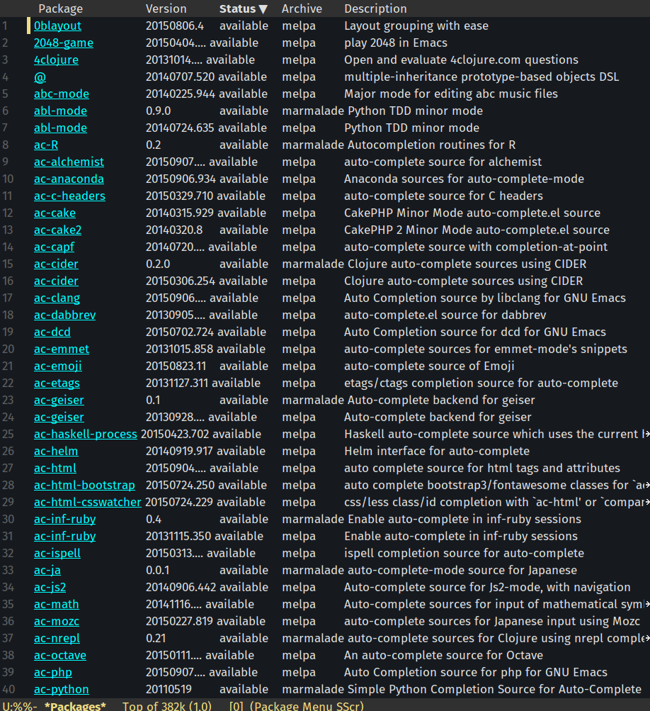

# git-flow on emacs featured magit
*注意*
- このスクリプトはあなたの環境を破壊する可能性があります。実行は自己責任でおねがいします。


Git-flowを導入するのは簡単だが、emacs, magitと連携させるのは
手間だったので、以下にやり方を示す。
## 1 required
僕の環境で試した際のversionなど

	・emacs24.5
	・git2.5.1
	・magit最新版
	・magit-popup最新版
	・git-flow最新版

## 2 install 手順

### 2.2 emacs24.4のinstall
不必要なものを予めremoveしておく。
ubuntu14.04の場合、aptで提供されているemacsのversionは24.3なので
emacs24.3以下をインストールしている場合はアンインストールする。
emacsのversionがわからない場合は、emacsを開いてから次のコマンドを
実行する。`M-x version`

では、emacs24.3と関連パッケージをアンインストールする。以下のコマンドを
実行する。

```sh
sudo apt-get remove emacs
sudo apt-get autoremove
```

慎重にアンインストールしたかったので、まずはemacs本体のみをremoveしてから、
不必要になった関連パッケージをautoremoveでアンインストールした。

次にemacs24.4をソースからビルドし、インストールする。
[このページ](http://ubuntuhandbook.org/index.php/2014/10/emacs-24-4-released-install-in-ubuntu-14-04/)
を参考にしたので、わからなければそちらを参照すること。

まずビルドに必要な依存パッケージをインストールする。

```sh
sudo apt-get install build-essential
sudo apt-get build-dep emacs24
```

次に、emacs24.4のソースを[公式ページ](http://ftp.gnu.org/gnu/emacs/)からダウンロード
する。`emacs-24.4.tar.gz`と書いてある箇所を見つけて、クリックすればダウンロードが始まる。
*ここからはダウンロード先が~/Downloads/*以下であると仮定してすすめる。

```sh
cd ~/Downloads
tar -xf emacs-24.4.tar.gz
cd emacs-24.4
```
次に以下のコマンドでemacs24.4をビルドしてインストールする。

```sh
./configure
make
sudo make install
```
参照ページでは、Emacs24.4のLauncherを作る項目があったが、何もせずとも問題なかった。

### 2.3 git-2.5.1のinstall
aptで提供されているgitのversionではmagit-gitflow.elが動いてくれないので、
PPAから最新版をインストールする。以下のコマンドを実行すれば良い。

```sh
sudo add-apt-repository ppa:git-core/ppa  
sudo apt-get update  
sudo apt-get install git
```
### 2.4 git-flowのインストール
gitflowをインストールする。
`sudo apt-get install git-flow`
### 2.5 magit.el 最新版のインストール
ここからはemacsのパッケージの更新の話になるので注意。

まず、不必要なpackageを削除する。
emacsを起動し、`M-x list-packages`を実行すると、mlpaから提供されている、
パッケージが確認できる。


古いパッケージをいくつかDeleteする必要があったのでまずそこからやる。
`C-s`で`git-commit`と`git-rebase`を検索し、該当箇所で`d`キーを押し、パッケージ横に
Dと表示されたら、`x`キーを押し、削除を実行する。
さらに、`magit`と`magit-popup`も削除しておく。

不必要or古いパッケージのDeleteが終わったら、以下のパッケージをインストールする。
該当するパッケージの箇所にカーソルを合わせてから`i`キーを押すと選択したパッケージ
の先頭に`I`が表示されているはずなので、よければそのまま、`x`キーを押してインストールすれば良い。

	magit
	magit-popup
	magit-gitflow

インストールが終了したら、`M-x package-initialize`を実行するか、emacsを再起動する。
エラーメッセージがでなければ、次はinit.elにmagit-gitflowの設定を記述する。
`~/.emacs.d/init.el`


	;; magit
	(global-set-key (kbd "C-x g") 'magit-status)

	;;magit-flow
	(require 'magit-gitflow)
	(add-hook 'magit-mode-hook 'turn-on-magit-gitflow)


## 3 Usage
- `C-x g`で`magit-status`を呼ぶ。
- magit-statusバッファで`C-f`を実行する。


